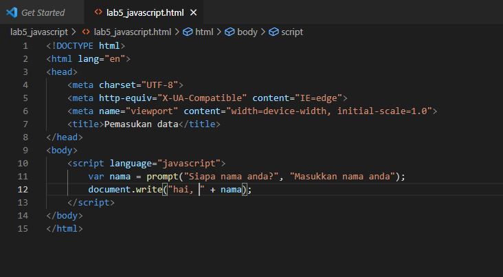

# Lab5Web
## Belajar javascript
Untuk menempatkan javascript pada HTML gunakan tag `<script>`.
Buat file dengan nama lab5_javascript.html, kemudian ketikan kode berikut.

Nntuk output dari document.write() langsung muncul di browser.

Namun untuk melihat output dari consol.log() dengan cara klik kanan pada browser kemudian pilih inspeksi dan klik bagian consol seperti gambar dibawah.

## Javascript Dasar

### Pemakaian Alert sebagai property window.

Simpan tag `<script>` di bagian tag `<body>` dan ketikan kode sebagai berikut.

Ini tampilannya di browser.

### Pemakaian method dalam objek

Simpan tag `<script>` di bagian tag `<body>` dan ketikan kode sebagai berikut.

Ini tampilannya di browser.

### Pemakaian prompt

Simpan tag `<script>` pada tag `<body>` kemudian tuliskan kode berikut.

Ini tampilannya di browser.

Kemudian kita disuruh untuk memasukan nama seperti dibawah ini.

Dan ini hasilnya.

### Pembuatan fungsi dan cara pemanggilannya

Simpan tag `<script>` pada tag `<head>` yang berisi ***function pesan()***, kemudian untuk memanggil fungsi tersebut tambahkan ***onload=pesan()*** pada tag `<body>` seperti dibawah.

Ini tampilannya di browser.

## Dasar Pemrograman Di Javascript
### Operasi dasar aritmatika

Tulis kode berikut.

Ini tampilannya di browser.

Kemudian klik button tersebut, dan ini hasilnya.

### Seleksi kondisi (if else)

Tuliskan kode berikut.

Ini tampilannya di browser. Dan kita di perintahkan untuk memasukkan nilai.

Setelah nilai dimasukkan, maka ini hasilnya.

Sesuai dengan perintahnya bahwa nilai 60 ke atas akan lulus.

### Penggunaan operator switch untuk seleksi kondisi

Simpan javascriptnya pada tag `<head>` kemudian tuliskan kode berikut.

dan pada tag `<body>` di tambahkan tag `<unput>` seperti berikut.

Ini tampilannya di browser.

Kemudian klik button tersebut.

Setelah dimasukan nilai, maka hasilnya seperti berikut.

## Pembuatan Form
### Form Input

Pada tag `<head>` tuliskan kode javascript menggunakan function dengan kondisi if else dan pada tag `<body>` tambahkan tag `<form>` seperti berikut.

Ini tampilannya di browser.

Kemudian masukkan bilangan yang diinginkan, contohnya seperti dibawah.

Otomatis angka akan terbaca, kalau angka tersebut ganjil maka hasilnya ganjil begitupun sebaliknya.

### Form Button

Tambahkan tag `<script>` pada tag `<body>` kemudian tuliskan function. Tambahkan pula tag `<h1>` dan tag `<form>` dimana didalam tag `<form>` ada tag `<input>`. Kemudian tambahkan lagi tag `<script>` yang berisi tanggal modifikasi. Gambarnya seperti berikut.

Ini tampilannya di browser.

Ketika di klik button **latar belakang hijau** maka backgroundnya akan berubah hijau seperti pada gambar.

## HTML DOM
### Pilihan menggunakan checkBox dengan perhitungan otomatis

Simpan javascript pada body kemudian tulis kode berikut.

Ini tampilannya di browser.

Ketika pilihannya di centang semua, maka akan dijumlahkan semua begitu pun sebaliknya ketika hanya dua yang dicentang, maka akan dijumlahkan dua saja.

## Pertanyaan dan Tugas
### 1. Buat script untuk melakukan validasi pada isian form.

Pertama buat file dengan nama validasi_javascript.html kemudian isikan kode berikut.

Ini tampilannya di browser.

Ketika tidak ada yang ke isi, maka akan muncul tulisan seperti yang di atas.
